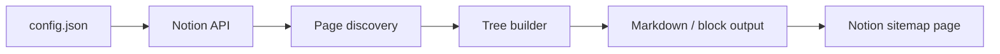

# Chaos Monk Workspace Sitemap

**A local-first Notion workspace indexer for people whose systems have outgrown their memory.**

Chaos Monk Workspace Sitemap is a small Python tool that crawls a Notion workspace and generates a clean, navigable sitemap. It is built for founders, students, operators, and teams who live in Notion but eventually lose track of where everything is.

The value is simple:

> Run the tool. Get a map of your workspace. Stop hunting through nested pages.

[](https://chaosmonk.netlify.app)
[](https://mageelawrence.gumroad.com/l/ocnvh)
[](https://python.org)

---

## What this is

A lightweight command-line utility that uses the Notion API to discover pages, organize them into a hierarchy, and write a linked sitemap back into a Notion page you choose.

It is intentionally boring in the best way:

- no server
- no subscription requirement
- no telemetry
- no cloud database
- no complicated setup
- one local config file
- one focused job

---

## The problem

Notion starts clean. Then it becomes a second brain, then a command center, then a junk drawer with good intentions.

Pages multiply. Databases nest. Projects spread across workspaces. The search box helps, but it does not show structure.

Chaos Monk gives you a map.

---

## What it does

- Crawls shared Notion pages through the Notion API
- Builds a parent-child page hierarchy where available
- Generates a linked sitemap in a Notion page
- Supports dry-run output before writing changes
- Handles pagination and basic rate-limit behavior
- Keeps your token and workspace data local

---

## How it works

```text
Local config → Notion API → page discovery → hierarchy builder → sitemap output
```



---

## Use cases

| User | Why it helps |
|---|---|
| Founder | Map product notes, investor docs, SOPs, and roadmap pages |
| Student | Organize classes, assignments, research, and reference material |
| Operator | Keep a personal command center searchable and structured |
| Team | Create a shared orientation map for a growing workspace |
| Consultant | Quickly understand a client workspace before cleanup or migration |

---

## Design principles

| Principle | Meaning |
|---|---|
| Local-first | The tool runs on your machine, not on my server |
| Minimal dependencies | Keep setup simple and failure points low |
| Readable output | The sitemap should help humans, not just machines |
| User control | You decide what page receives the sitemap |
| Practical over fancy | One small tool, one clear job |

---

## Tech stack

| Component | Technology |
|---|---|
| Language | Python 3.10+ |
| API | Notion API |
| Config | JSON |
| Runtime | Local command-line execution |
| Output | Notion page sitemap |

---

## Privacy and security posture

Chaos Monk Workspace Sitemap is designed as a local utility.

- Your Notion token stays in your local config file
- The tool does not require a hosted backend
- It does not add analytics or telemetry
- It only runs when you run it
- It is meant to write only to the sitemap page you configure

As with any tool using an API token, users should create a dedicated Notion integration and only share the pages they want the tool to access.

---

## Product package

The paid package includes:

- `indexer.py` — workspace sitemap script
- `config.json` template
- setup guide
- Notion sitemap template
- local-first usage notes

Get it here: **[$10 one-time purchase](https://mageelawrence.gumroad.com/l/ocnvh)**

---

## Portfolio note

This repo also serves as a public product artifact. It shows how I think about small useful tools: identify a real workflow pain, keep the architecture simple, explain the security posture, and package the result clearly.

---

## Built by

**Lawrence Magee**  
U.S. Army IT veteran · AI systems builder · founder/operator building practical tools under MAGE Software / Malleus Prendere LLC

- GitHub: [@lmagee3](https://github.com/lmagee3)
- Product site: [chaosmonk.netlify.app](https://chaosmonk.netlify.app)
